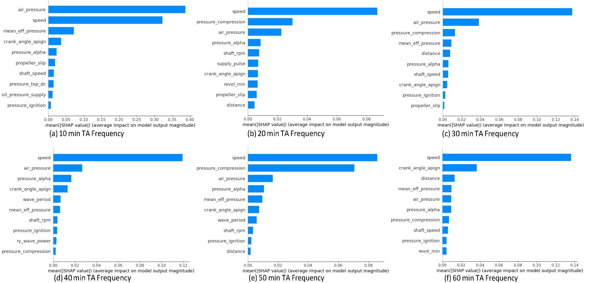
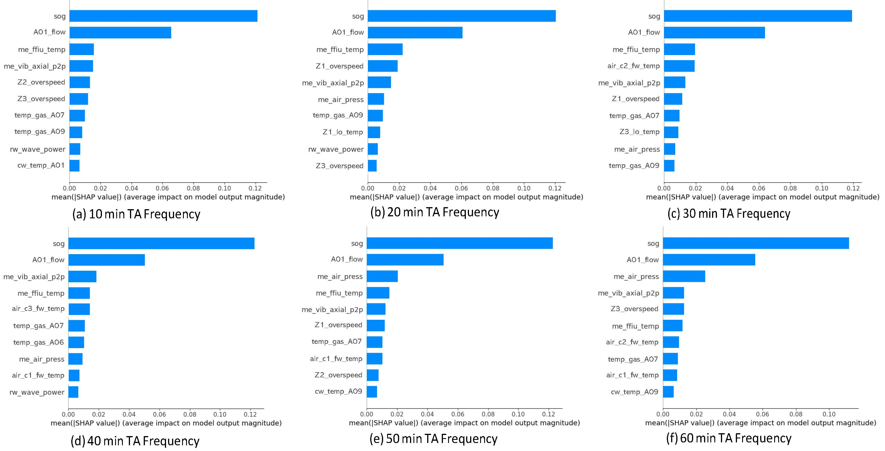
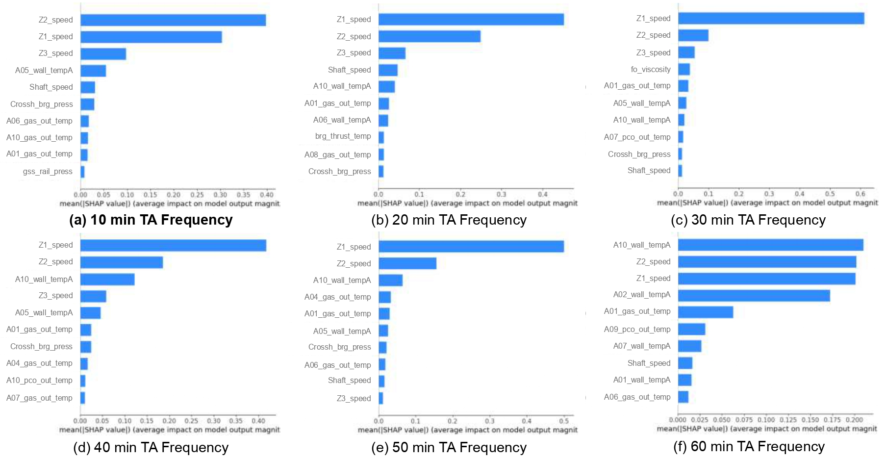
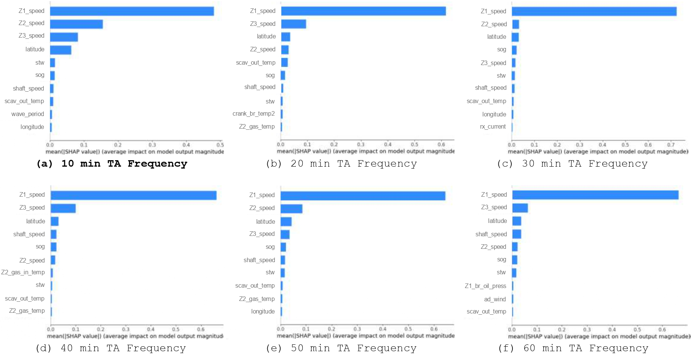
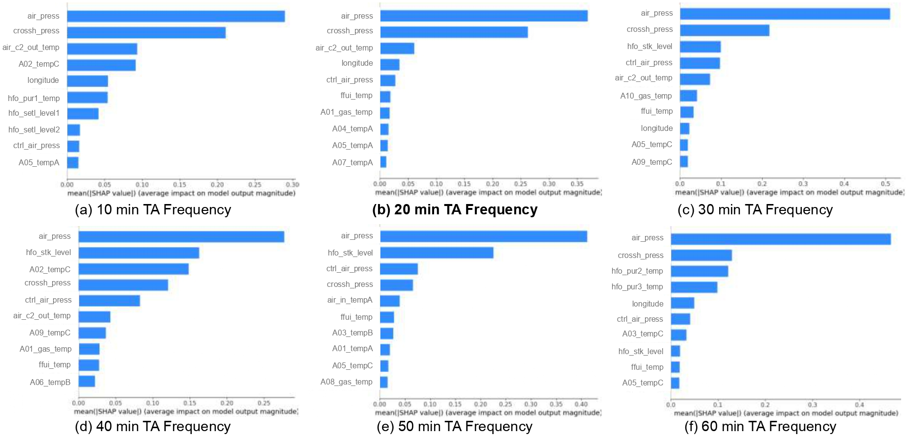
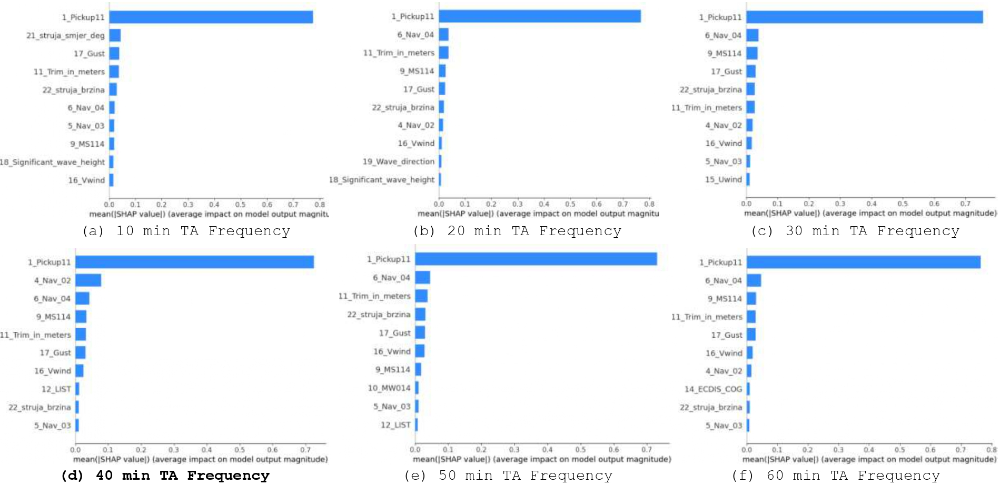

# Optimal TA Frequency Selection

## Overview

This repository contains the code, experimental setup, and supplementary analyses for our research work on **explainable temporal aggregation frequency selection in multivariate time series**.

The proposed framework addresses the challenge of identifying an appropriate temporal aggregation frequency, a key preprocessing step that strongly affects both predictive performance and model reliability. It combines supervised learning with SHAP-based analysis and integrates two complementary criteria: coherence, which evaluates the consistency of feature attributions within groups of related variables, and sensitivity, which measures the stability of these attributions under small changes in temporal resolution.

These criteria are combined into a unified reliability cost function, whose minimization enables the automatic selection of an aggregation frequency that balances interpretability and robustness.

## Additional Experimental Results

Additional results, not included in the main paper due to page limitations, are provided in this appendix.

### Reliability of Predictive Models (continued from Sec. 5.1.2)

For SHIP 3 (Figure G.1), "speed" remained the dominant predictor across all TA frequencies. However, at the 10-minute and 20-minute frequencies, where the highest R² scores were achieved (0.937 and 0.935, respectively), the models relied on entirely different features. For instance, "air_pressure" contributed marginally (0.38) at 10 minutes but dropped to 0.03 at other frequencies, while variables like "distance" and "pressure_compression" appeared and disappeared inconsistently.

  

  <strong>Figure G.1.</strong> SHAP feature importance for the SHIP 3.

For SHIP 4 (Figure G.2), "sog" (speed over ground) consistently emerged as the top predictor of fuel consumption, reflecting maritime knowledge that higher speeds increase fuel consumption. "A01_flow" also remained influential across all TA frequencies. Stability in these features, along with the overspeed of "Z_k" and the gas temperature of A07 and A09 at 10-minute aggregation, aligns with technical knowledge. In contrast, temperature-related variables (e.g., "me_ffiu_temp", "air_c2_fw_temp") showed fluctuating importance across TA frequencies, indicating inconsistent rankings.

  

  <strong>Figure G.2.</strong> SHAP feature importance for the SHIP 4.

For both SHIP 5 (Figure G.3) and SHIP 6 (Figure G.4), three equipments (Z1, Z2, and Z3) are expected to operate in parallel and contribute equally to the engine’s performance, making their corresponding speed variables ("Z1_speed", "Z2_speed", and "Z3_speed") functionally similar and equally relevant for predicting fuel consumption. However, the SHAP plots reveal that this expected coherence is not consistently captured across all temporal aggregation frequencies. 

  

  <strong>Figure G.3.</strong> SHAP feature importance for the SHIP 5.

At several frequencies, particularly 40 and 50 minutes for SHIP 5, the three speed variables exhibit marked discrepancies in importance, with "Z3_speed" systematically receiving lower attribution despite its operational equivalence. This indicates potential instability in the learned model representations. By contrast, the 10-minute frequency for both SHIP 5 and SHIP 6 presents a more coherent attribution pattern, with "Z1_speed", "Z2_speed", and "Z3_speed" receiving comparable importance, thus aligning with domain expectations.

  

  <strong>Figure G.4.</strong> SHAP feature importance for the SHIP 6.

For SHIP 7 (Figure G.5), "air_press" consistently dominates the feature importance rankings across all temporal aggregation frequencies, confirming its critical role in predicting fuel consumption. Other variables such as "crossh_press" and "hfo_stk_level" also rank highly but show fluctuations across different frequencies. Notably, at the 20-minute frequency, variables "A04_tempA", "A05_tempA", and "A07_tempA" exhibit a more balanced distribution of importance compared to other aggregation levels.

  

  <strong>Figure G.5.</strong> SHAP feature importance for the SHIP 7.

For the Seagoing SHIP (Figure G.6), the variable "1_Pickup11" (main engine revolutions per minute) consistently dominates across all temporal aggregation frequencies, aligning with domain knowledge that engine RPM strongly influences fuel consumption (Vorkapić et al., 2021). However, the 40-minute frequency exhibits a distinctive pattern where "1_Pickup11" and "4_Nav_02" (ship’s speed over ground) - two highly functionally related variables - appear consecutively as the top predictors, with relatively closer SHAP attributions. This pattern suggests that the 40-minute frequency captures inter-variable relationships more coherently than other aggregation levels.

  

  <strong>Figure G.6.</strong> SHAP feature importance for the Seagoing SHIP.

## References

- Vorkapić, A., Radonja, R., & Martinčić-Ipšić, S. (2021). *Predicting Seagoing Ship Energy Efficiency from the Operational Data*. **Sensors, 21**(8), 2832. https://doi.org/10.3390/s21082832.

